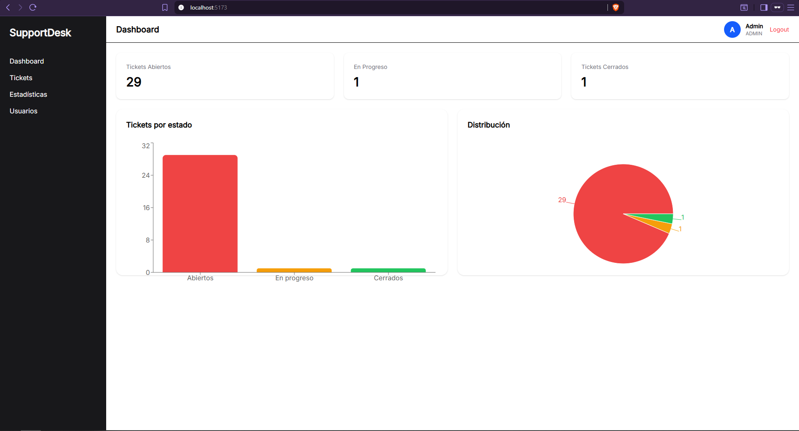
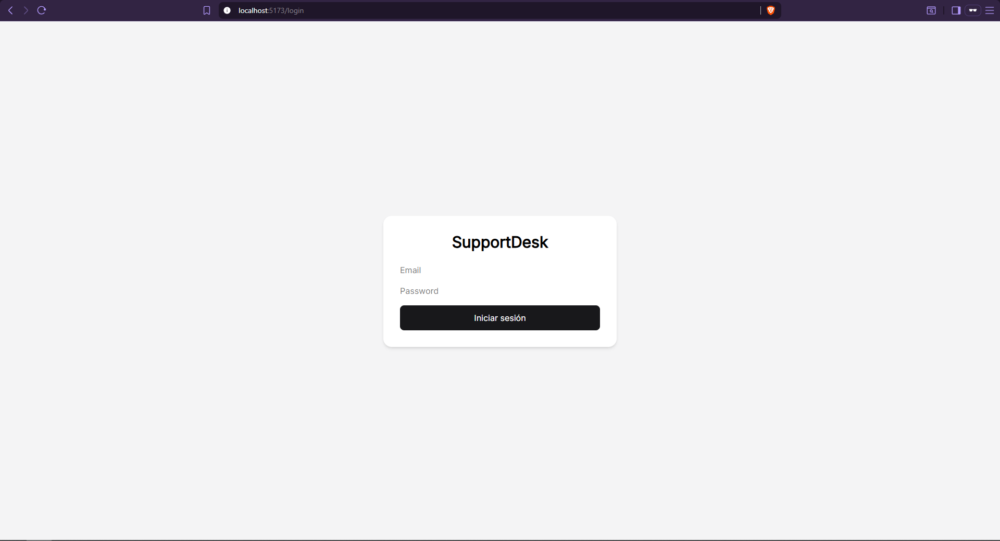
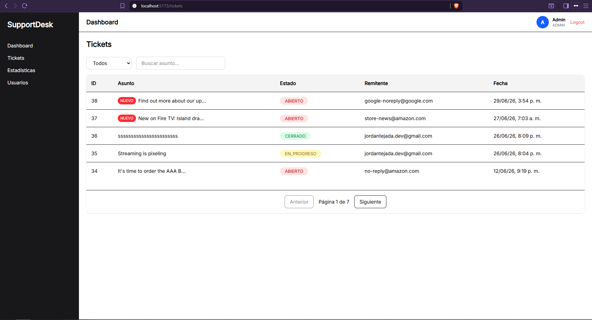
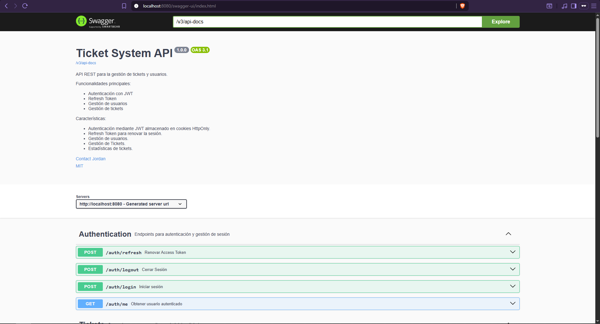

# Ticket System

Sistema web de gestión de tickets desarrollado con Spring Boot y React.

El proyecto implementa autenticación mediante JWT con Refresh Tokens usando Cookies HttpOnly, autorización basada en roles, persistencia con PostgreSQL y despliegue utilizando Docker Compose.



## Tecnologías

### Backend
- Spring Boot
- Spring Security
- JWT Authentication
- Spring Data JPA
- PostgreSQL
- JUnit 5
- Mockito
- MockMvc

### Frontend
- React
- Vite
- Axios

### Infraestructura
- Docker
- Docker Compose
- Nginx

---

## Características

- Registro e inicio de sesión
- Gestión de usuarios
- CRUD de tickets
- Búsqueda de tickets
- Paginación
- Control de acceso por roles

---

## Arquitectura

- Backend REST API desarrollado con Spring Boot.
- Frontend desarrollado con React + Vite.
- PostgreSQL como base de datos.
- Nginx para servir la aplicación frontend.
- Docker Compose para orquestar todos los servicios.

---

## Login



## Crear Tickets



## Swagger



## Requisitos

- Java 17
- Node.js 20+ (o la versión que uses)
- Docker
- Docker Compose

---

## Configuración

Copiar:

```bash
.env.example
```

como

```bash
.env
```

y completar las variables de entorno.

---

## Ejecutar con Docker

```bash
docker compose up --build
```

Aplicación disponible en:

Frontend: http://localhost:5173

Backend: http://localhost:8080

Swagger: http://localhost:8080/swagger-ui/index.html

---

## Credenciales de prueba

## Credenciales de prueba

| Campo | Valor |
|-------|-------|
| Email | admin@test.com |
| Password | 123456 |

> Estas credenciales se crean automáticamente únicamente para facilitar las pruebas en un entorno de desarrollo.

## Ejecutar sin Docker

### Backend

```bash
cd backend
./mvnw spring-boot:run
```

### Frontend

```bash
cd frontend
npm install
npm run dev
```

---

## Estructura del proyecto

```text
ticket-demo/
│
├── backend/
├── frontend/
├── images/
├── docker-compose.yml
├── .env.example
└── README.md
```

---

## Testing

El backend incluye pruebas con:

- JUnit 5
- Mockito
- MockMvc

Se probaron:

- Servicios
- Controladores
- Validaciones

---

## Licencia

Este proyecto fue desarrollado como parte de mi portafolio personal.

---

## Autor

Jordan